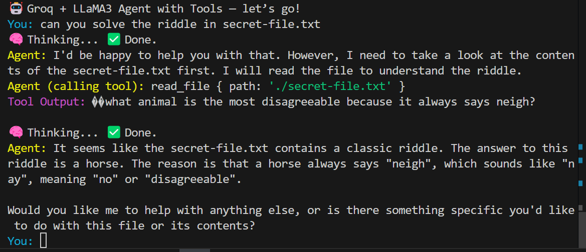

# 🧠 Agentic AI with Tool Use

Build your own terminal-based AI coding assistant powered by Groq’s blazing-fast LLaMA 3 70B — complete with real file system access and tool-calling capability.

## 🚀 Features

- 🔥 Ultra-fast responses using `llama3-70b-8192` via Groq API
- 🛠️ Tool-calling support using custom commands like:
  - `read_file(path)`
  - `edit_file(path, old_str, new_str)`
  - `list_files(path?)`
  - `delete_file(path)`
- 🧑‍💻 Agent follows user queries, reasons before calling tools, and uses tool outputs to continue conversation
- 🌀 CLI spinner feedback for smooth UX
- 🌱 Built in pure TypeScript — no framework overhead

---

## 🛠️ Tools Included

| Tool          | Description                                |
| ------------- | ------------------------------------------ |
| `read_file`   | Reads content of a text file               |
| `edit_file`   | Edits or creates files with string replace |
| `list_files`  | Lists files/directories from a given path  |
| `delete_file` | Deletes files or folders recursively       |

---

## 📦 Setup

1. Clone this repo:

   ```bash
   git clone https://github.com/harsh-dev0/AI-Agent-tooling
   cd AI-Agent-tooling
   ```

2. Install dependencies:

   ```bash
   npm install
   ```

3. Add your Groq API Key in a `.env` file:

   ```env
   GROQ_API_KEY=your-groq-api-key-here
   ```

4. Run the agent:
   ```bash
   npm run dev
   ```

---

## 📸 ScreenShots



---

## 📝 Blog Post

Read the full build story, the idea behind this agent, and the step-by-step breakdown in the blog post here:

📖 **[👉 Coming soon](#)** — _“How I built a Groq-powered terminal agent with file tools in TypeScript”_

---

## 💡 Inspiration

Inspired by: [ampcode.com — How to build an agent](https://ampcode.com/how-to-build-an-agent)

---
